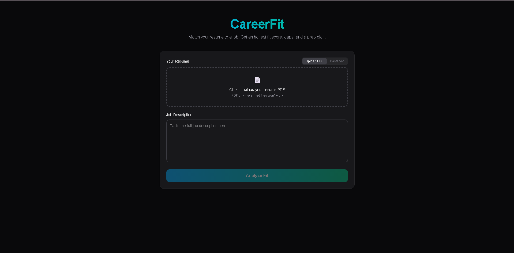
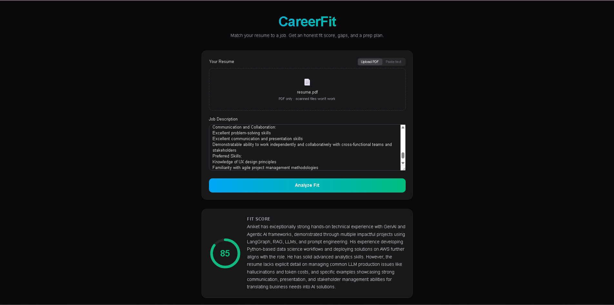

# CareerFit

Compare a resume against a real job description and get an honest fit analysis: a 0–100 score, missing skills, red flags, concrete resume improvements, and an interview prep plan — all from a single LLM call.

## How it works

```
PDF / pasted text ──> text extraction ──> Gemini 2.5 Flash ──> structured JSON ──> UI
```

One model call reads the resume and the JD together and returns all five sections as schema-enforced JSON. No keyword matching, no per-feature pipelines — the model does the reasoning.

## Screenshots

| Input | Fit score | Analysis |
|-------|-----------|----------|
|  |  |  |

## Stack

- **Backend:** Python · FastAPI · pypdf · google-genai (Gemini 2.5 Flash)
- **Frontend:** Next.js 16 · React 19 · TypeScript · Tailwind CSS v4
- **Output:** Pydantic schema enforced end to end (model output → API response → UI types)

## Project structure

```
CareerFit-Agent/
├── resume_parser.py      # PDF bytes -> text
├── agent.py              # (resume, JD) -> Analysis (the prompt + schema)
├── api.py                # POST /analyze
├── requirements.txt
└── frontend/
    └── app/
        ├── page.tsx          # state + composition
        ├── lib/              # api client + shared types
        └── components/       # ResumeInput, ScoreCard, SectionCard
```

## Setup

### Prerequisites
- Python 3.11+
- Node.js 18+
- A Gemini API key — free at [aistudio.google.com](https://aistudio.google.com/apikey)

### Backend

```bash
python -m venv venv
venv\Scripts\activate          # Windows  (source venv/bin/activate on macOS/Linux)
pip install -r requirements.txt
```

Create a `.env` file in the project root:

```
GOOGLE_API_KEY=your_key_here
```

Run it:

```bash
fastapi dev api.py             # http://localhost:8000  (docs at /docs)
```

### Frontend

```bash
cd frontend
npm install
npm run dev                    # http://localhost:3000
```

Open **http://localhost:3000**, upload a resume PDF (or paste text), paste a job description, and hit **Analyze Fit**.

## API

### `POST /analyze`

Form-data:

| Field         | Type   | Notes                                  |
|---------------|--------|----------------------------------------|
| `jd`          | string | Job description text (required)        |
| `resume_pdf`  | file   | Resume PDF — *or* use `resume_text`    |
| `resume_text` | string | Pasted resume — *or* use `resume_pdf`  |

Returns:

```json
{
  "fit_score": 78,
  "fit_summary": "Strong GenAI foundation, but...",
  "missing_skills": ["..."],
  "red_flags": ["..."],
  "resume_improvements": ["..."],
  "interview_prep": ["..."]
}
```

## Limitations

- **Scanned/image PDFs aren't supported** (no OCR) — paste the text instead.
- **Gemini free tier** has rate limits; fine for personal use, not production traffic.
- Resumes are sent to Google's API — don't use the free tier with data you can't share.
